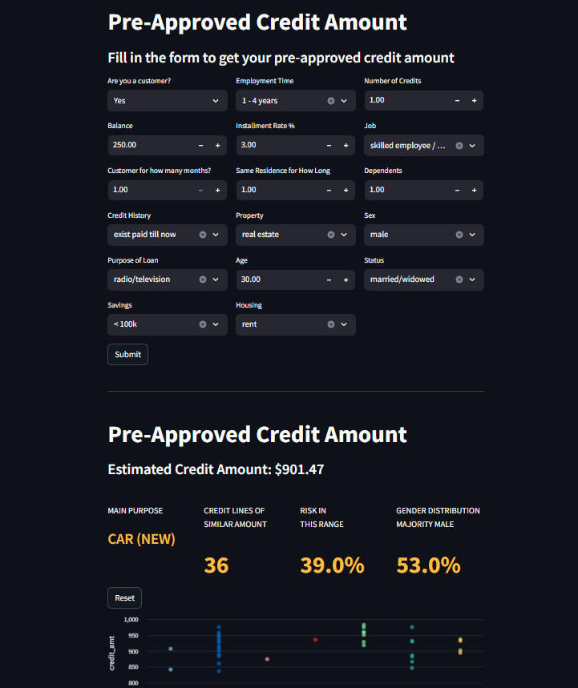
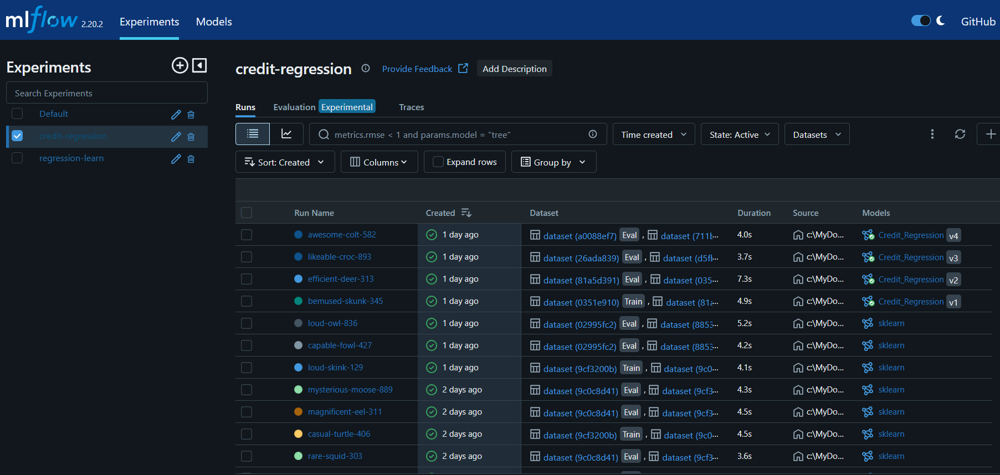
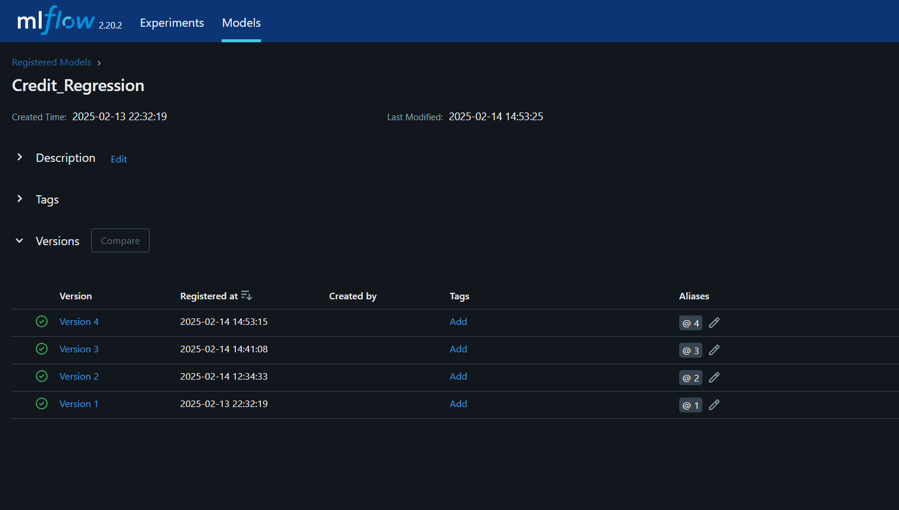

# Credit_Risk

## Purpose
1. Train a *Linear Regression* model to estimate the amount of credit that is pre-approved by a client, based on the database of approved credit lines for a given bank.
2. The second objective is to train another model to classify either the client will default or not.
3. Both models will be deployed into an *Streamlit* Web app.

## Tools and Methods
This project leverages many skills of Data Science and Data Engineering.
* `Scikit-Learn`: The models created for the credit amount estimate were Linear Regression and LightGBM. 
It was used techniques such as Standardization, Box-Cox transformation, Feature Selection.
Although this dataset was not initially intended to be used on a regression model, I wanted to create an extra step to make the project more interesting. 
The model to determine the probability of default will be created at a later date.
* `MLFlow`: *MLFlow* is an excellent tool for both Data Scientists and Data Engineers, as it is used for experimentation, where we can keep track of the models trained and the results. It is easy enough to move the winning model to the **Model** tab and make it production ready.
* `Docker`: Productionizing a project is always the biggest challenge. The dependencies, versions and different environments can make a project break. Docker comes to solve this problem as it places the project in a Linux container and standardizes the environment.

## Environment

### Python Version
3.12.1

### Requirements
* `ipykernel` >=6.29.5
* `jinja2` >= 3.1.5
* `lightgbm` >= 4.5.0
* `matplotlib` >= 3.10.0
* `mlflow` >= 2.20.2
* `numpy` >= 2.2.2
* `pandas` >= 2.2.3
* `scikit-learn` >= 1.6.1
* `scipy` >= 1.15.1
* `seaborn` >= 0.13.2
* `streamlit` >= 1.42.0
* `ucimlrepo` >= 0.0

## Getting Started

#### Prerequisites
Git installed on your system
Docker and Docker Compose installed on your system

#### Step-by-Step Instructions

1. Clone the Credit Risk repository:
Run `git clone https://github.com/gurezende/Credit_Risk.git` in your terminal.
This will download the Credit Risk repository to your local machine

2. Start the application using Docker Compose:
Navigate to the credit-risk directory: `cd credit-risk` 
Run `**docker-compose up --build**` to build and start the containers.

#### What to Expect
The MLflow server will be available at http://localhost:5000 
The Streamlit app will be available at http://localhost:8501

#### Troubleshooting
If you encounter any issues during the build process, check the Docker Compose logs for errors. 
If you're unable to access the MLflow server or Streamlit app, ensure that the containers are running and that the ports are correctly mapped

## Images
<table>
  <tr>
    <td width="33%"></td>
    <td width="33%"></td>
    <td width="33%"></td>
  </tr>
</table>